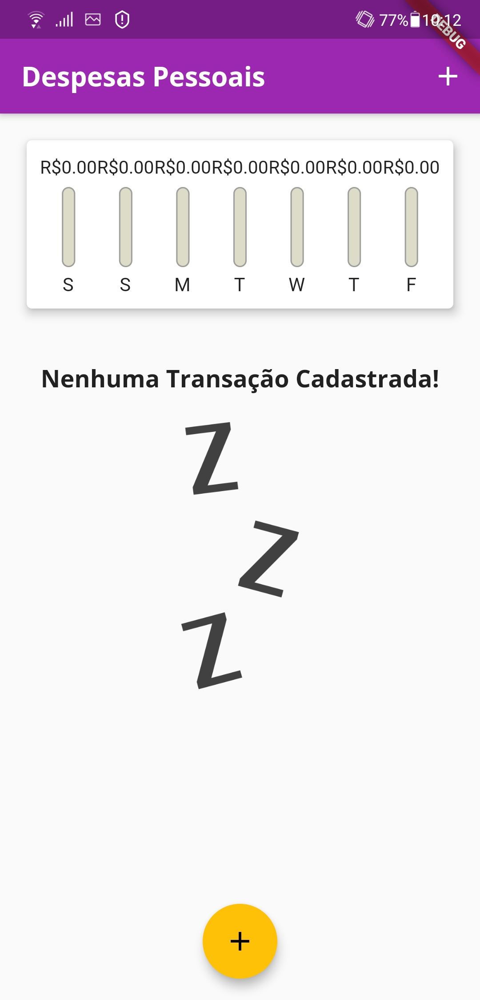
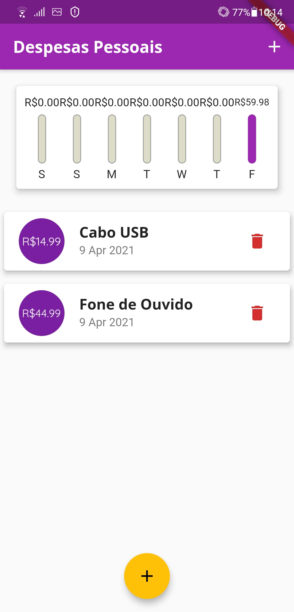
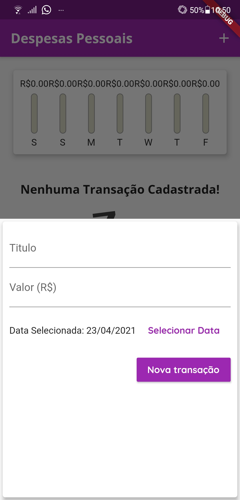
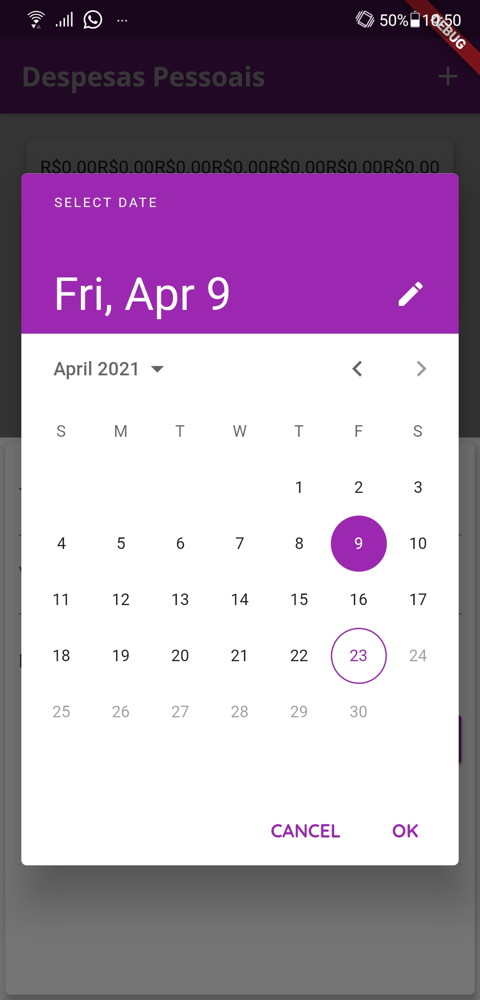
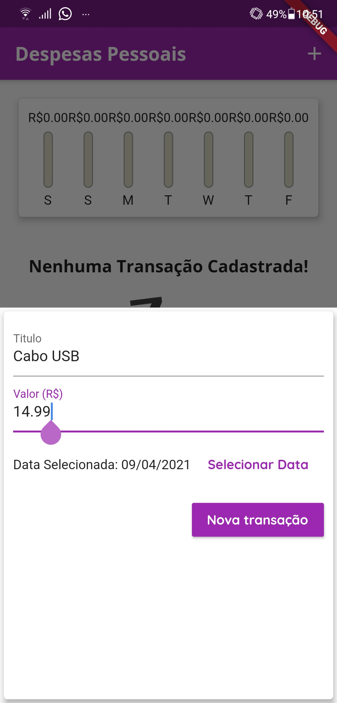

# Expenses

Um aplicativo simples para organizar suas despesas, feito em Dart usando o Flutter. 

## Descrição

### Tela inicial
Ao abrir o aplicativo será essa a tela (primeira imagem) que irá ver, essa é a tela inicial do aplicativo onde mostra suas despesas, identificada por nome, valor e data </br>
Na parte superior há um grafico mostrando seus gastos da semana e em qual dia esta concentrado o gasto </br>
O botão flutuante amarelo embaixo e o botão localizado no canto superior direito, servem para adicionar um novo registro de despesa</br>
<table>
  <tr>
    <td>Tela Inicial vazia</td>
    <td>Tela Inicial com algumas despesas</td>
  </tr>
  <tr>
    <td valign="top"></td>
    <td valign="top"></td>
  </tr>
</table>

### Adicionar um registro de despesa
Após clicar no botão para adicionar um registro, como mencionado acima, irá aparecer um formulario para preencher
Exemplo:
<table>
  <tr>
    <td>Formulario para preencher</td>
    <td>Calendario dentro do formulario para</br> selecionar a data da despesa</td>
    <td>Exemplo de formulario preenchido</td>
  </tr>
  <tr>
    <td valign="top"></td>
    <td valign="top"></td>
    <td valign="top"></td>
  </tr>
</table>


## Guia
```
git clone https://github.com/alberesdejesus/App-Expenses-Flutter.git
cd App-Expenses-Flutter
flutter packages get
flutter run
```
Coloque no seu emulador ou Smartphone e aproveite!! 
